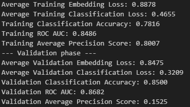
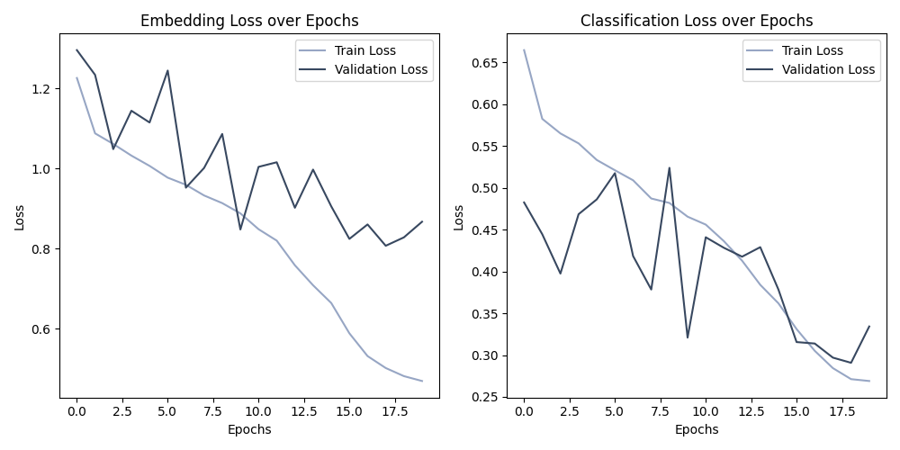
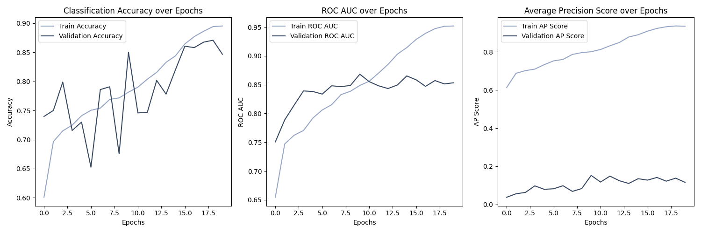
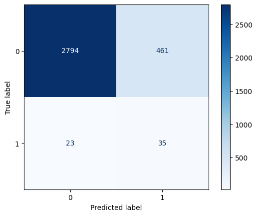
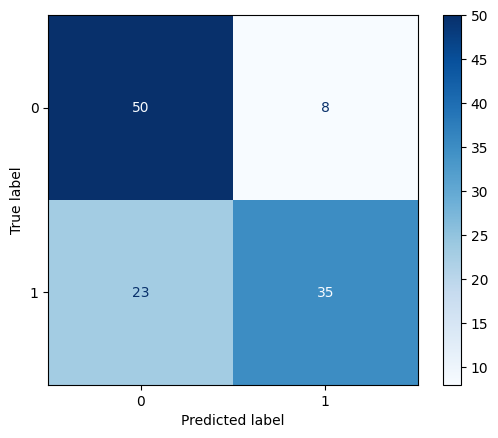
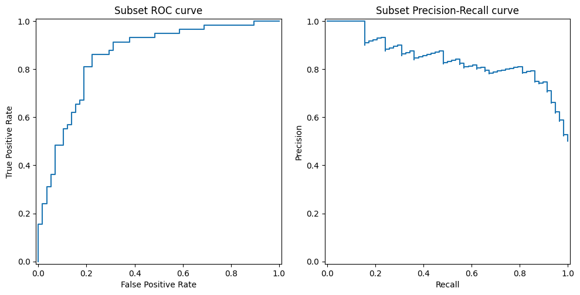
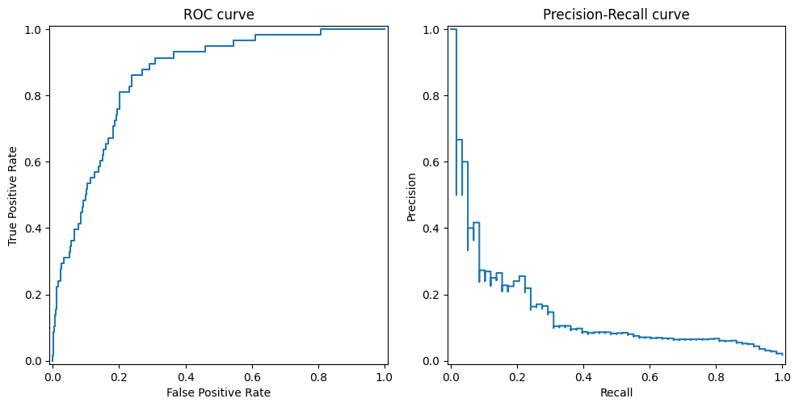
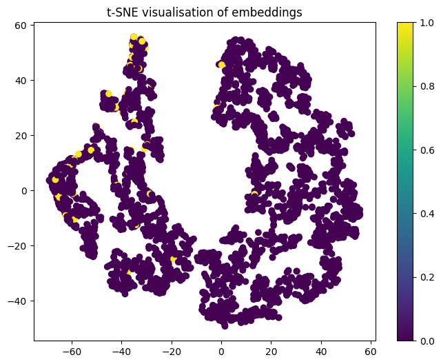
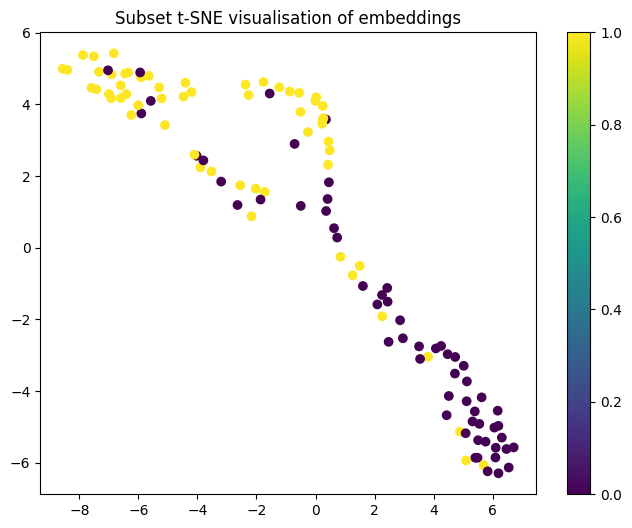

# Siamese network for the ISIC 2020 Kaggle Challenge classification

Melissa Maillot - s4851573

## Problem

### Data

The ISIC 2020 Kaggle Challenge is a classification problem where skin lesions need to be classified between melonoma and normal. The dataset contains 33126 images. The dataset has severe class imbalance with only 584 melonoma samples and 32542 normal samples.

### Siamese networks

We implement a siamese network with triplet loss to attempt to solve this issue. 

Siamese networks are a type of metric learning model, that aims to compare the similarity of samples. Siamese networks learns to distinguish samples from different classes by using a twin network with equal weights. Both samples are passed in the network which extracts their features, and the distance between extracted embedding vectors are compared.

In the case of classification, the training of the siamese networks aims at distinguishing the different classes in the embedding dimension, such that a classifier can be trained on the embeddings. The siamese is used as a feature extractor that maximises the embedding distnaces between classes such that the classifier may easily distinguish classes in this high dimensional space.

Two types of loss are usually used for training a siamese network: contrastive lost and triplet loss. In this implementation, we use triplet loss. Triplet loss compares the distance between embedings of sample of the same class and a sample from another class. 

## Implementation

### Model

The implemented neural network has two parts: a feature extractor and a classification head.

The feature extratctor architecture is a ResNet50 model (not pre-trained) from the PyTorch library [[1](#references)], with the last layer modified to change the extractor head and embedding dimension. As stated above, triplet loss was used.

The classificaiton head is just a single layer perceptron with an output dimension of two for the two classes. Cross entropy loss was used as the loss function for the classifier head.

### Metrics

Several metrics will be used to understand the model's performance.

First, classification accuracy will be used to get a general idea of the model's performance. However this metric isn't ideal to understand the full performance of the classifier, as the heavy data imbalance makes in unrealiable if the datasubset being considered is not balanced.

Then, we will consider the area under the reciever operating characteristic curve (ROC-AUC). It helps us understand how well the model finds true positives compared to false positives, which can help us better understand whether classifier detects melanoma and whether it incorrectly classifies benign as malignant. 

Also, accorrding to [[2](#references)][[3](#references)][[4](#references)], ROC-AUC is not always ideal for binary classification, especially in our case with high imbalance in the dataset. One of the main issue is that ROC-AUC dose not allow us to correctly gauge the importance of false negatives. However, false negatives are extremely important in this context: an undetected melanoma can evolve into a life-threatening condition. As such false negatives are much more worrying than false positives. Since ROC-AUC fails to totally capture their importance, we will also be considering the area under the precision-recall curve (AUPRC), also called the average precision (AP) score. The precision-recall curve plots the precision (`tp/(tp+fp)`) against the recall (`tp/(tp+fn)`). The recall thus includes the much needed information on false negatives into the metric and can help us gauge whether the model could miss malignant cases. The AP score is implemented in `scikit-learn` [[5](#references)].

### File structure

#### Data downloading and storage

The data used in this project is the preprocessed ISIC 2020 dataset available [here](https://www.kaggle.com/datasets/nischaydnk/isic-2020-jpg-256x256-resized/data). In this dataset, the images have been resized to `256x256`. The metadata files only contains the images labels, image names and patient IDs. 

To run the code in this repository, you need to download the dataset from the above kaggle link to the machine that will run the code. Ideally, the downloaded materials should be placed in their own folder. The data needs to be reorganised to fit the following structure:

```
your-data-folder-name/
├── train-metadata.csv
└── image/
    ├── ISIC_0015719.jpg
    ├── ISIC_0052212.jpg
    └── ...
```

This `your-data-folder-name` folder can be placed anywhere in the machine, so long as the path to the folder is passed to the `DATA_ROOT` hyperparameter. The parameter is currently set such that if the folder is named `data`, it should be placed in this location after cloning the repository:

```
PatternAnalysis-2025/recognition/Siamese_Network_Maillot/
│
├── README_figures/
│   └── ...
│
├── dataset.py
├── modules.py
├── predict.py
├── train.py
├── README.md
│
└── data/
    ├── train-metadata.csv
    └── image/
        ├── ISIC_0015719.jpg
        ├── ISIC_0052212.jpg
        └── ...
```

#### Code files

`dataset.py` contains all the classes required for data manipulation and data loading. This class handles making a 80/10/10 train/validation/test split of the data. It also oversamples the minority class for the training set, such that the training set is balanced. At runtime, the training data will be augmented with rotations, flips and colour jitters. The validation and testing set are not oversampled nor augmented. 

`modules.py` contains the neural network architectures and the triplet loss function implementation. The neural network consists of a ResNet50 and a simple classifier head. The triplet loss function is implemented by hand, following the following equation:

```
L(A, P, N) = max(0, ||f(A) - f(P)||^2 - ||f(A) - f(N)||^2 + margin)
```

`train.py` contains the main training loop and its helper functions. The training loop will save the best model as well as the loss log and metric log plots to the data location folder (for ease of ignoring with git if needed, this does not affect the dataloading). Calling this file will run the whole data retrieval, model training and testing code. 

`predict.py` contains code to evaluate the model on the test split of the dataset. It produces metrics as well as plots. Plots will also be saved to the data location folder for consistency. The metrics computed are: accuracy, ROC AUC, AP score, sensitivity, specificity: The plots are: confusion matrix, ROC curve, precision-recall curve, t-SNE visualisation of embeddings. 

### Python and dependencies

This project uses Python version `3.13.7`

Additonally, the following packages are required in the following versions:
- torch: 2.8.0+cu126
- torchvision: 0.23.0+cu126
- numpy: 2.1.2
- scikit-learn: 1.7.2
- matplotlib: 3.10.6
- pandas: 2.3.3

## Results

Here we present results of the most successful run of training.

### Hyperparameters

The hyperparameters for the model that gave the best metrics were as follows:

```py
EMBEDDING_DIM = 128
MARGIN = 1.25
NUM_EPOCHS = 20
LEARNING_RATE = 1e-4
TRAIN_DATA_SUBSET_FRACTION = 0.3
TRAIN_BATCH_SIZE = 32 
VAL_TEST_BATCH_SIZE = 256
```

The optimiser used was `Adam` and the learining rate scheduler was `OneCycleLR` with the following parameters:

```py
max_lr=LEARNING_RATE 
steps_per_epoch=train_samples.shape[0]//TRAIN_BATCH_SIZE//100
epochs=NUM_EPOCHS
anneal_strategy="cos"
```

### Model training

The model was trained for 20 epoch, but the model with the highest AP score was from epoch 10. The training and validation metrics of that model are as follows:



The loss over the different epochs show that the model had low loss on the validation set on that epoch. 



There is also high validation accuracy on that epoch. The validation ROC AUC and the AP score are at their highest in that epoch.



We notice that the validation triplet loss, the ROC AUC and the AP score somewhat plateau after the tenth epoch. However, the classificaiton loss and the classification accuracy continue increasing. This was not further investigated, however it may be a result of training both the embedder and the classification head at the same time. It may potentially be insightful to modify the training so that both components are trained separately on their own number of epochs, optimiser and scheduler. This was not tested due to lack of time.

### Model testing

The model was tested on the test set. The metrics were evaluated once on the test set and once on a balanced subset of the test set giving us different insights. 

Test metrics on the full test set were as follows:

```
Classification Accuracy: 0.8539
ROC AUC: 0.8573
Average Precision Score: 0.1503
Sensitivity: 0.6034
Specificity: 0.8584
```

Test metrics on the test set sample were as follows:

```
Classification Accuracy: 0.7328
ROC AUC: 0.8546
Average Precision Score: 0.8437
Sensitivity: 0.6034
Specificity: 0.8621
```

The sensitivity is low, which shows the model predicts too many false negatives. The influence of the class imbalance is also seen in how the classification accuracy changes between the two.

The confusion matrices show the same issue.

Here the confusion matrice on the full test set:



Here the confusion matrice on the test set sample:



The ROC curve and the precision-recall curve on the test subset don't look too alarming.



However the precision-recall curve on the full test set shows a different story.



These plots also show that the ROC curve cannot always be trusted, especially with imbalanced datasets. The ROC looks similarly good in both cases, and the ROC AUC in general has looked promising through this whole process. The precision-recall curve here shows that the model is not performing as well as the ROC suggests. 

Now we consider the t-SNE representation of the embeddings.



The visualisation of embeddings for the full test set seems to suggest the presence of two groups. The normal lesion are overwhelmingly present in both groups. The melanoma lesion are mostly fould in the left part of the left group, which suggest that despite its mild performance, the model does find some sort of pattern in the data. 



The embeddings on sample show that the two groups are destinct from each other to some extent. It may suggest that there are some distinct features that can discriminate both classes, but those features have not been sufficiently learnt but the model.

### Review of results

This trained model is not optimal. Some metrics such as AP score (on the testing subset) and ROC AUC seem to convey that the model acheives well. However, the problem at hand is a medical problem and misclassifications as false negatives can have life-threatening repurcussion. Melanomas are one of the main causes of skin cancer, and as such a misclassification could end in the death of a patient. The problem with this model is its very high sensitivity (false negative rate). A false positive is less of an issue as manual revue of lesions classified as positive is likely to take place. The goal of such a classifier is to filter out any benign skin lesion such that manual review is not needed. So any melanoma missed is one too many and the current model misses too many to be reliable. Improvements are requiered for this model to fully serve its intended function.

## Improvements

This model is far from optimal. The number of false negatives is still much to high. This is an issue as melanoma can evolve into life-threatening conditions if not treated early. In that sense, this current model is unrealiable for unseen data. Several points of improvement may include:
- Training on a larger subset of the data: most of the data is currently not used in training as the computing power to train on the full dataset was not available (training times were too long).
- Changing the triplet loss for batch hard mining triplet loss. [[6](#references)] suggests that batch hard mining is a more efficient way to train the model, as it only uses hard triplets to calculate the loss. Implimenting this loss was attempted but unsuccessful: the model did not learn, it is unknown where the issue stemmed from and there was not enough time to troubleshoot the issue.
- More extensive hyper-parameter tuning and more exploration of different augmentation techiniques.
- Experimenting with the model architecture, whether it may be changing the embedder architecture, the classifier head, or even make the embedder and the classifier to seperate networks to have more control over the training of each part respectively. 

## References
- [1] resnet50. Available at: https://docs.pytorch.org/vision/main/models/generated/torchvision.models.resnet50.html
- [2] The relationship between Precision-Recall and ROC curves. Available at: https://dl.acm.org/doi/10.1145/1143844.1143874
- [3] Imbalanced Data? Stop Using ROC-AUC and Use AUPRC Instead. Available at: https://towardsdatascience.com/imbalanced-data-stop-using-roc-auc-and-use-auprc-instead-46af4910a494/
- [4] ROC AUC vs Precision-Recall for Imbalanced Data. Available at: https://machinelearningmastery.com/roc-auc-vs-precision-recall-for-imbalanced-data/
- [5] `average_precision_score`. Available at: https://scikit-learn.org/stable/modules/generated/sklearn.metrics.average_precision_score.html#sklearn.metrics.average_precision_score
- [6] In Defense of the Triplet Loss for Person Re-Identification. Available at: https://arxiv.org/pdf/1703.07737